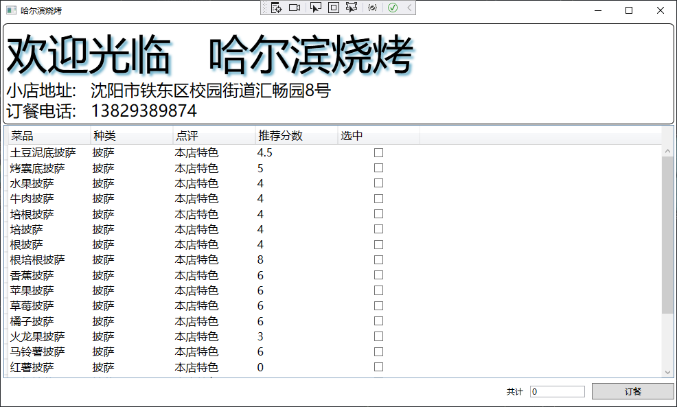

## WPF桌面程序 学习笔记 第N章  使用MVVM编写餐馆订餐系统

来源于: 根据[刘铁猛 《深入浅出WPF》系列高清视频教程](https://www.bilibili.com/video/BV1ht411e7Fe/?spm_id_from=333.1007.top_right_bar_window_custom_collection.content.click&vd_source=db5f224185fdd2c28b4cc762ebce92fe)整理。

这是一个稍微复杂的MVVM结构实现WPF界面程序的例子。例子中包含了业务抽象成Model过程,业务操作/显示界面View和两者的中间处理过程ViewModel，也有业务数据Data与ViewModel中通信的Service过程。
通过例子，我们能够进一步深入了解MVVM的运行机制，和业务抽象成对象的面向对象编程思想。


### 需求和分析需求

确定实现目标是编写软件的开始，而分析需求并抽象化是面向对象编程的十分重要的部分。

我们要编写一个餐馆订餐系统。顾客查看菜单，选在其中的菜品中的项目后，确定点餐，系统将选择的菜品条目保存。

界面如下:



我们可以看到，界面中有餐馆信息`Restaurant`、菜品列表信息`Dish`、显示订餐信息的文本框和订餐按钮。

因此我们可以将数据部分抽象成两大类，餐馆信息类和菜单信息类。由于菜单信息包含条目较多，我们创建一个单独的数据文件保存，这样也方便修改菜品。因此我们按照`MVVM`的管理创建`Models`文件夹保存抽象的类文件和`Data`保存具体的数据文件。

当然实际程序开发中，餐厅的信息也应该有单独的数据文件保存，这样做参观信息能够方便修改使系统更为通用，避免了信息硬编码至代码的弊端。此练习实例不单独创建文件保存。

前端界面的设计，可以结合业务需求进行规划和创建，选择使用的界面元素满足业务需求。界面设计实际上是个复杂的过程，但本实例主要讲述`MVVM`框架的实现。因此前端界面直接使用图片中的界面实现，即上部采取文字块`TextBlock`描述餐馆信息，下半部菜单使用`DataGrid`列表结合`CheckButton`列示选择菜品,界面最后使用`Button`确认点餐和`TextBox`空间统计菜品总数。

但对于MVVM来说，无论采取何种形式的界面，都不影响后端数据处理逻辑的构建，这也是使用这种设计模式需要达到的目的。

之后是围绕`MVVM`的核心 `ViewModel`构建类。我们需要将`Model`在此处实例化并填充数据，赋值给能够对外暴露的属性供前端`View`使用。对于填充数据的部分，我们采取两种方式：

- 直接创建类餐馆信息类`Restaurant`实例，并在此处填充实例信息。实例作为属性以供`View`使用。  
- 对于列表信息`Dish`，我们需要读取`Data.xm`保存的菜品信息数据实现。为了保持可扩展，我们创建`Service`部分，具体为能够实现`List<Dish> GetAllDishs();`的 `IDataServices`接口，即一种能够返回`List<Dish>`的方法。如果未来菜单信息保存在数据库中，可以使用实现此接口的数据库读取类。本例中创建了实现`IDataServices`接口的读取`Data.xml`文件的类。  
- 进一步思考`Dish`的功能：在界面中的菜单选项，包含了菜单内容和一个选择框。勾选选择框后，作为选中的菜品。选择完成后，选中的菜品信息保存在文件中。实际上界面中的`“Dish”`项目比`Model`中纯数据`Dish`多了一个选择布尔值。由于这是界面信息部分，新建一个包含一个选中布尔值的类在`ViewModel`中是合适的。


### 创建Model数据模型

创建菜单类`Models.Dish.cs`:
```c#
namespace CrazyElephant.Client.Models;

//对应data文件夹中单条数据模型
internal class Dish
{
    public string Name{get; set;}  // 菜品名称
    public string Category{get; set;}  //  种类
    public string Comment{get; set;}  //  点评
    public double Score{get; set;}  //  推荐分数
}
```
我们看到，这里创建了`Dish`菜单类四个属性，而界面中显示还有`选中`项目。这里的考虑是，选中项目是界面交互的要素，而不是纯的数据抽象，因此将此项目放在`ViewModel`中，而不是放在此处。

餐馆信息类`Models.Restaurant.cs`:
```c#
namespace CrazyElephant.Client.Models;
internal class Restaurant
{
    public string Name{get; set;}  // 餐馆名
    public string Address{get; set;}  // 餐馆地址
    public string PhoneNumber{get; set;} //订餐电话 
}
```

`Data`文件夹中单独保存菜单信息的`Data.xml`文件:
```xml
<?xml version="1.0" encoding="utf-8" ?>
<Dishes>
  <Dish>
    <Name>土豆泥底披萨</Name>
    <Category>披萨</Category>
    <Comment>本店特色</Comment>
    <Score>4.5</Score>
  </Dish>
  <Dish>
    <Name>烤囊底披萨</Name>
    <Category>披萨</Category>
    <Comment>本店特色</Comment>
    <Score>5</Score>
  </Dish>
  <Dish>
    <Name>水果披萨</Name>
    <Category>披萨</Category>
    <Comment>本店特色</Comment>
    <Score>4</Score>
  </Dish>
  ......
</Dishes>
```


### 创建`ViewModel`

在创建`ViewModel`我们对于界面已经有了初步的规划，并知道界面需要以何种方式展示数据，也决定了我们向`View`部分暴露那些数据。

在开始创建`ViewModel`之前我们需要完成以下准备工作:

####  双向通信基础

引入`View`和`ViewModel`通信的基础类。我们可以使用`Microsoft.Practices.Prism`框架来实现数据的通信基础和事件的通信基础。

引入类和继承使用方法如下(展示一个属性和一个事件的双向通信建立):
```c#
using Microsoft.Practices.Prism.Commands;  //可以使用其中的 DelegateCommand
using Microsoft.Practices.Prism.ViewModel;  //可以使用其中的 NotificationObject
internal class MainWindowViewModel: NotificationObject
{
    // 声明一个DelegateCommand类委托，具有事件的双向通知能力
    public DelegateCommand PlaceOrderCommand {get; set;}  
    public DelegateCommand SelectMenuItemCommand {get; set;}
    public Restaurant Restaurant
    {
        get => _restaurant;
        set
        {
            _restaurant = value;
            // NotificationObject中的方法，使这个属性具有双向通信的能力
            this.RaisePropertyChanged("Restaurant");  
        }
    }

    private void SelectMenuItemExecute()
    {
        this.Count = this.DishMenu.Count(i=>i.IsSelected==true);
    }

    public MainWindowViewModel()
    {
        this.LoadRestaurant();
        this.LoadDishMenu();
        PlaceOrderCommand = new DelegateCommand(new Action(PlaceOrderCommandExcute));
        SelectMenuItemCommand = new DelegateCommand(new Action(SelectMenuItemExecute));

    }
}
```

#### 创建读取和写入数据的服务

由于我们需要从本地文件`Data.xml`中读取菜单信息，并把点餐信息写入本地文件，我们需要建立这两个`Service`。

首先建立文件夹`Service`，用于保存服务接口和实现。在文件夹中创建两个服务接口，`IDataServices`和`IOrderServices`。创建接口后，提供服务方无论从本地文件或数据库保存读取方式，都需实现这两个接口。使用服务方，则需要调用这两个接口即可获取数据和保存数据。

`IDataServices.cs`
```c#
namespace CrazyElephant.Client.Services;
//声明数据获取的接口。之所以声明接口，实际上为了应对数据来源的变化。
//不同数据来源，保证实现此接口，那么对于数据的使用方，不会产生影响。也是解耦合的一种体现。
internal interface IDataServices
{
    List<Dish> GetAllDishs();
}
```

实现`IDataServices`接口，从文件`@"Data\Data.xml"`中读取数据并返回`List<Dish>`类型的数据。
```c#
using CrazyElephant.Client.Models;

namespace CrazyElephant.Client.Services;
//xml数据来源于文件的一种实现IDataServices接口的方式。
internal class XmlDataServices : IDataServices
{
    public List<Dish> GetAllDishs()
    {
        var dishList = new List<Dish>();

        string xmlFileName = System.IO.Path.Combine(Environment.CurrentDirectory, @"Data\Data.xml");
        XDocument xDoc = XDocument.Load(xmlFileName);
        var dishes = xDoc.Descendants("Dish");

        foreach (var dish in dishes)
        {
            Dish dish_tmp = new Dish();
            dish_tmp.Name = dish.Element("Name").Value;
            dish_tmp.Category = dish.Element("Category").Value;
            dish_tmp.Comment = dish.Element("Comment").Value;
            dish_tmp.Score = double.Parse(dish.Element("Score").Value);
            dishList.Add(dish_tmp);
        }
        return dishList;
    }
}
```

`IOrderServices.cs`
```c#
namespace CrazyElephant.Client.Services;
internal interface IOrderServices
{
    void PlaceOrder(List<string> dishes);
}
```

实现`IOrderServices`接口，即将`List<string> dishes`数据保存至文件中。
```c#
namespace CrazyElephant.Client.Services;
//IOrderServices的一种实现方式，存储在硬盘的txt文件中
internal class MockOrderServices : IOrderServices
{
    public void PlaceOrder(List<string> dishes)
    {
        System.IO.File.WriteAllLines(@"C:\order.txt", dishes.ToArray());
    }
}
```

#### 创建`ViewModel`并设计暴露的数据 

拓展`Dish`类，是至保存菜品信息的`Dish`类增加是否选中的属性，同时为这个新增属性增加双向通信能力。
```c#
using CrazyElephant.Client.Models;
using Microsoft.Practices.Prism.ViewModel; //NuGet下载PrismMVVMLibrary

namespace CrazyElephant.Client.ViewModel;
//每单菜单项目包含菜品的信息和选项有否的信息，因此存在动作与单纯的保存信息的Dish不同
//将Dish的信息引入到DishMenuItem中有三种方法:
//1. 继承自类Dish，即DishMenuItemViewModes类是一个Dish
//2. 在DishMenuItemViewModes类中声明一个Dish类实例，即DishMenuItemViewModes类有一个Dish
//3. 直接在DishMenuItemViewModes中声明Dish的四个属性，即不再使用单独的Dish类
internal class DishMenuItemViewModel: NotificationObject
{
    public Dish Dish
    {
    get; set; }
    public bool IsSelected
    {
        get => isSelected;
        set
        {
            isSelected = value;
            this.RaisePropertyChanged("isSelected");
        }
    }

    private bool isSelected;
}
```

根据界面要求，我们需要在`ViewModel`类中公开的数据类有`Count`,`Restaurant`,`DishMenu`,   公开的事件有,`PlaceOrderCommand`,`SelectMenuItemCommand`。

`MainWindowViewModel`类:
```c#
using CrazyElephant.Client.Models;
using CrazyElephant.Client.Services;
using Microsoft.Practices.Prism.Commands;
using Microsoft.Practices.Prism.ViewModel;

namespace CrazyElephant.Client.ViewModel;
internal class MainWindowViewModel: NotificationObject
{
    public DelegateCommand PlaceOrderCommand {get; set;}  //公开的事件: 确定订餐内容后需要执行的操作
    public DelegateCommand SelectMenuItemCommand {get; set;}  //每选中一条需要执行的动作
    public int Count  //公开属性: 用于统计选中数量并展示的属性。
    {
        get => _count;
        set
        {
            _count = value;
            this.RaisePropertyChanged("Count");  //公开的属性需要有双向通信能力。
        }
    }

    public Restaurant Restaurant  // 公开属性: 界面展示的餐馆信息
    {
        get => _restaurant;
        set
        {
            _restaurant = value;
            this.RaisePropertyChanged("Restaurant");
        }
    }

    public List<DishMenuItemViewModel> DishMenu  // 公开属性: 菜单信息
    {
        get => dishMenu;
        set
        {
            dishMenu = value;
            this.RaisePropertyChanged("DishMenu");
        }
    }

    private int _count;

    private Restaurant _restaurant;

    private List<DishMenuItemViewModel> dishMenu;


    private void LoadRestaurant()  // 实例化并写入餐馆信息
    {
        this.Restaurant = new Restaurant();
        this.Restaurant.Name = "哈尔滨烧烤";
        this.Restaurant.Address = "沈阳市铁东区校园街道汇畅园8号";
        this.Restaurant.PhoneNumber = "13829389874";
    }

    private void LoadDishMenu()  // 实例化并写入菜单信息
    {
        XmlDataServices ds = new XmlDataServices();
        var dishes = ds.GetAllDishs();
        this.DishMenu = new List<DishMenuItemViewModel>();
        foreach (var dish in dishes)
        {
            DishMenuItemViewModel item = new();
            item.Dish = dish;
            this.DishMenu.Add(item);
        }
    }

    private void PlaceOrderCommandExcute()
    {
        // 此处，之索引能够从DishMenu中检索到已选择的菜品，是由于前端和后端数据具有双向通信机制；前端选中后，后端的属性也随之更改了。
        var selectedDishes = this.DishMenu.Where(i => i.IsSelected == true).Select(i=>i.Dish.Name).ToList();
        IOrderServices orderServices = new MockOrderServices();
        orderServices.PlaceOrder(selectedDishes);
        MessageBox.Show("订餐成功!");

    }

    private void SelectMenuItemExecute()
    {
        this.Count = this.DishMenu.Count(i=>i.IsSelected==true);
    }

    public MainWindowViewModel()
    {
        this.LoadRestaurant();
        this.LoadDishMenu();
        // 将函数委托给事件
        PlaceOrderCommand = new DelegateCommand(new Action(PlaceOrderCommandExcute));
        SelectMenuItemCommand = new DelegateCommand(new Action(SelectMenuItemExecute));

    }

}
```

### 创建界面`View`

```xml
<Window x:Class="CrazyElephant.Client.MainWindow"
        xmlns="http://schemas.microsoft.com/winfx/2006/xaml/presentation"
        xmlns:x="http://schemas.microsoft.com/winfx/2006/xaml"
        xmlns:d="http://schemas.microsoft.com/expression/blend/2008"
        xmlns:mc="http://schemas.openxmlformats.org/markup-compatibility/2006" xmlns:viewmodel="clr-namespace:CrazyElephant.Client.ViewModel" d:DataContext="{d:DesignInstance Type=viewmodel:MainWindowViewModel}"
        mc:Ignorable="d"
        Title="{Binding Restaurant.Name}" Height="600" Width="1000" WindowStartupLocation="CenterScreen">
    <Grid Margin="3">

        <Grid.RowDefinitions>
            <RowDefinition Height="Auto" />
            <RowDefinition Height="*" />
            <RowDefinition Height="Auto" />
        </Grid.RowDefinitions>

        <Border BorderBrush="Black" BorderThickness="1" CornerRadius="6" Padding="4">
            <StackPanel>
                <StackPanel Orientation="Horizontal">
                    <StackPanel.Effect>
                        <DropShadowEffect Color="LightBlue"></DropShadowEffect>
                    </StackPanel.Effect>
                    <TextBlock Text="欢迎光临   " FontSize="60"></TextBlock>
                    <TextBlock Text="{Binding Restaurant.Name}" FontSize="60"></TextBlock>
                </StackPanel>
                <StackPanel Orientation="Horizontal">
                    <TextBlock Text="小店地址:   " FontSize="24"></TextBlock>
                    <TextBlock Text="{Binding Restaurant.Address}" FontSize="24"></TextBlock>
                </StackPanel>                
                <StackPanel Orientation="Horizontal">
                    <TextBlock Text="订餐电话:   " FontSize="24"></TextBlock>
                    <TextBlock Text="{Binding Restaurant.PhoneNumber}" FontSize="24"></TextBlock>
                </StackPanel>
            </StackPanel>
        </Border>

        <DataGrid AutoGenerateColumns="False" GridLinesVisibility="None" CanUserDeleteRows="False"
                  CanUserAddRows="False" Margin="0.5" Grid.Row="1" FontSize="16" ItemsSource="{Binding DishMenu}">
            <DataGrid.Columns>
                <DataGridTextColumn Header="菜品" Binding="{Binding Dish.Name}" Width="120"></DataGridTextColumn>
                <DataGridTextColumn Header="种类" Binding="{Binding Dish.Category}" Width="120"></DataGridTextColumn>
                <DataGridTextColumn Header="点评" Binding="{Binding Dish.Comment}" Width="120"></DataGridTextColumn>
                <DataGridTextColumn Header="推荐分数" Binding="{Binding Dish.Score}" Width="120"></DataGridTextColumn>
                <DataGridTemplateColumn Header="选中" SortMemberPath="isSelected" Width="120">
                    <DataGridTemplateColumn.CellTemplate>
                        <DataTemplate>
                            <CheckBox IsChecked="{Binding Path=IsSelected, UpdateSourceTrigger=PropertyChanged}"
                                          VerticalAlignment="Center" HorizontalAlignment="Center"
                                          Command="{Binding Path=DataContext.SelectMenuItemCommand, RelativeSource={RelativeSource Mode=FindAncestor, AncestorType={x:Type Window}}}">
                            
                            </CheckBox>
                        </DataTemplate>
                    </DataGridTemplateColumn.CellTemplate>

                </DataGridTemplateColumn>
            </DataGrid.Columns>
            
        </DataGrid>

        <StackPanel Orientation="Horizontal" HorizontalAlignment="Right" Grid.Row="2">
            <TextBlock Text="共计" VerticalAlignment="Center"></TextBlock>
            <TextBox Margin="10" Width="80" VerticalAlignment="Center" IsReadOnly="True"
                Text="{Binding Count}"></TextBox>
            <Button Width="120" Height="24" Content="订餐" VerticalAlignment="Center" Command="{Binding PlaceOrderCommand}"></Button>
        </StackPanel>
    </Grid>
</Window>
```

### 完成后项目的文件树

```
C:.
│  App.xaml
│  App.xaml.cs
│  AssemblyInfo.cs
│  CrazyElephant.Client.csproj
│  CrazyElephant.Client.csproj.user
│  CrazyElephant.Client.sln
│  MainWindow.xaml
│  MainWindow.xaml.cs
|
├─Data
│      Data.xml
│
├─Models
│      Dish.cs
│      Restaurant.cs
│
├─Services
│      IDataServices.cs
│      IOrderServices.cs
│      MockOrderServices.cs
│      xmlDataServices.cs
│
├─ViewModels
│      DishMenuItemViewModel.cs
│      MainWindowViewModel.cs
│
└─Views
```

示例程序 [餐馆订餐系统](WPF-906CrazyElephant.Client)使用win10下的`visualstudio2022`完成，框架是`.NET6`，`NuGet`引入了一个依赖项`PrismMVVMLibrary(Version="2.0.0.10")`。

(End)