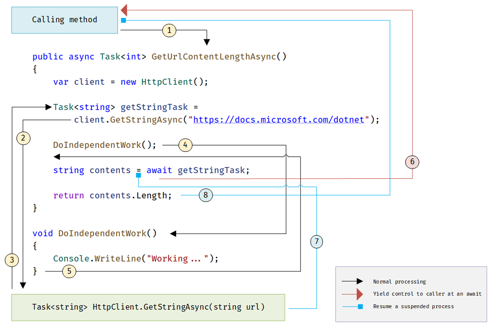

## C# 自我初学笔记 第N章  

来源于: 根据[微软的 异步编程 文档](https://learn.microsoft.com/zh-cn/dotnet/csharp/programming-guide/concepts/async/task-asynchronous-programming-model)整理。


### c#的异步编程模型

通过使用异步编程，你可以避免性能瓶颈并增强应用程序的总体响应能力。 但是，编写异步应用程序的**传统技术**可能比较复杂，使它们难以编写、调试和维护。

C# 支持简化的方法，即异步编程，它利用 `.NET` 运行时中的异步支持。 编译器可执行开发人员曾进行的高难度工作，且应用程序保留了一个类似于同步代码的逻辑结构。 因此，你只需做一小部分工作就可以获得异步编程的所有好处。

### 异步编程提升响应能力

异步对可能会被屏蔽的活动（如 Web 访问,特别是在UI界面变成过程中）至关重要。 对 Web 资源的访问有时很慢或会延迟。 如果此类活动在同步过程中被屏蔽，整个应用必须等待。 在异步过程中，**应用程序可继续执行不依赖 Web 资源的其他工作(如UI界面的变化调整)**，直至潜在阻止任务完成。

下表显示了异步编程提高响应能力的典型区域。 列出的 `.NET`  `API` 包含支持异步编程的方法。(`Windows` 运行时 `API` 和更多的支持异步 `API` 详见文档)

|应用程序区域|包含异步方法的 .NET 类型|
|-|-|
|Web 访问|[HttpClient](https://learn.microsoft.com/zh-cn/dotnet/api/system.net.http.httpclient)|
|使用文件|[JsonSerializer](https://learn.microsoft.com/zh-cn/dotnet/api/system.text.json.jsonserializer)|
|使用文件|[StreamReader](https://learn.microsoft.com/zh-cn/dotnet/api/system.io.streamreader)|
|使用文件|[StreamWriter](https://learn.microsoft.com/zh-cn/dotnet/api/system.io.streamwriter)|
|使用文件|[XmlReader](https://learn.microsoft.com/zh-cn/dotnet/api/system.xml.xmlreader)|
|使用文件|[XmlWriter](https://learn.microsoft.com/zh-cn/dotnet/api/system.xml.xmlwriter)|


由于所有与用户界面相关的活动通常共享一个线程，因此，异步对访问` UI `线程的应用程序来说尤为重要。 如果任何进程在同步应用程序中受阻，则所有进程都将受阻。 你的应用程序停止响应，因此，你可能在其等待过程中认为它已经失败。

使用异步方法时，应用程序将继续响应` UI`。 例如，你可以调整窗口的大小或最小化窗口；如果你不希望等待应用程序结束，则可以将其关闭。


### 异步语法

`C#` 中的 **`Async` 和 `Await` 关键字是异步编程的核心**。 通过这两个关键字，可以使用 `.NET Framework`、`.NET Core` 或 `Windows` 运行时中的资源，轻松创建异步方法（几乎与创建同步方法一样轻松）。 **使用 `async` 关键字定义的异步方法简称为“异步方法”**。

一个简单的异步方法如下:
```c#
public async Task<int> GetUrlContentLengthAsync()
{
    var client = new HttpClient();

    Task<string> getStringTask =
        client.GetStringAsync("https://docs.microsoft.com/dotnet");

    DoIndependentWork();

    string contents = await getStringTask;

    return contents.Length;
}

void DoIndependentWork()
{
    Console.WriteLine("Working...");
}
```

异步方法的特征:

1. 方法签名: 
    - 包含 `async` 关键字
    - 返回值是一个 `Task<TResult>`类型或 `void`。
    - 方法名称的约定, 以 `Async` 结尾

2. 方法声明中的返回类型
    - 方法体中的 `return` 类型为 `TResult`
    - 不返回值的方法 (即同步方法中的 `void`)直接使用 `Task`,即不接泛型；
    - `void`: 异步事件处理程序，例如界面的 `Click`等响应事件不使用`Task`
    - 具有 GetAwaiter 方法的任何其他类型。

3. 方法体中至少包含一个 `await`表达式：该表达式标记一个点，在该点上，直到等待的异步操作完成方法才能继续。 同时，将方法挂起，并且控件返回到方法的调用方。 


在异步方法中，可使用提供的关键字和类型来指示需要完成的操作，且编译器会完成其余操作，其中包括持续跟踪控件以挂起方法返回等待点时发生的情况。

### 异步方法的运行机制

异步编程中**最需弄清的是控制流是如何从方法移动到方法的**。 

下图可引导你完成此过程：



流程解释如下:

1. 调用方法调用并等待 `GetUrlContentLengthAsync` 异步方法。

2. `GetUrlContentLengthAsync` 可创建 `HttpClient` 实例并调用 `GetStringAsync `异步方法以下载网站内容作为字符串。

3. `GetStringAsync` 中发生了某种情况(如网络延迟)，该情况挂起了它的进程。 可能必须等待网站下载或一些其他阻止活动。 为避免阻止资源，**`GetStringAsync` 会将控制权出让给其调用方 `GetUrlContentLengthAsync`**。  

    `GetStringAsync` 返回 `Task<TResult>`，其中 `TResult` 为字符串，并且 `GetUrlContentLengthAsync` 将任务分配给 `getStringTask` 变量。 **该任务表示调用 `GetStringAsync` 的正在进行的进程**，其中承诺当工作完成时产生实际字符串值。(因此，将方法执行并分配给`Task`类型的变量之时，方法就开始执行了。)

4. 由于尚未`await` `getStringTask`(即没有询问完成结果)，因此，`GetUrlContentLengthAsync` 可以继续执行不依赖于 `GetStringAsync` 得出的最终结果的其他工作。 该任务由对同步方法 `DoIndependentWork` 的调用表示。

5. `DoIndependentWork `是完成其工作并返回其调用方的同步方法。

6. `GetUrlContentLengthAsync` 已运行完毕，可以不受 `getStringTask` 的结果影响。 接下来，`GetUrlContentLengthAsync` 需要计算并返回已下载的字符串的长度，但该方法只有在获得字符串的情况下才能计算该值。 

    因此，`GetUrlContentLengthAsync` 使用一个 `await` 运算符来挂起其进度，并把控制权交给调用 `GetUrlContentLengthAsync` 的方法。 `GetUrlContentLengthAsync` 将 `Task<int>` 返回给调用方。 该任务表示对产生下载字符串长度的整数结果的一个承诺。(即示例方法`GetUrlContentLengthAsync`的调用方也使用`Task` + `await`语句时，在外部形成的等待过程。)

    > 如果 `GetStringAsync`（因此 `getStringTask`）在 `GetUrlContentLengthAsync` 等待前完成(`DoIndependentWork`前已经完成)，则控制会保留在 `GetUrlContentLengthAsync` 中。 如果异步调用过程 `getStringTask` 已完成，并且 `GetUrlContentLengthAsync` 不必等待最终结果，则挂起然后返回到 `GetUrlContentLengthAsync` 将造成成本浪费。

    > 但对于 `UI` 编程，使用异步是必须的，因为我们不知道任务冻结过程中，用户会对界面做出什么操作，即主线程可能还有任务。


    在(外部)调用方法中，处理模式会继续。 在等待结果前，调用方可以开展不依赖于 `GetUrlContentLengthAsync` 结果的其他工作，否则就需等待片刻。 调用方法等待 `GetUrlContentLengthAsync`，而 `GetUrlContentLengthAsync` 等待 `GetStringAsync`。


7. `GetStringAsync` 完成并生成一个字符串结果。 字符串结果不是通过按你预期的方式调用 `GetStringAsync` 所返回的。 （记住，该方法已返回步骤 3 中的一个任务）。相反，字符串结果存储在表示 `getStringTask` 方法完成的任务中。 **`await` 运算符从 `getStringTask` 中检索结果**。 赋值语句将检索到的结果赋给 `contents`。(因此`await`表示"等等，我看看`Task`任务结果完成了没有，其他任务暂停"的意思;直到结果返回后，我将返回结果，并继续开启其他任务。)

8. 当 `GetUrlContentLengthAsync` 具有字符串结果时，该方法可以计算字符串长度。 然后，`GetUrlContentLengthAsync` 工作也将完成，并且等待事件处理程序可继续使用。 


### API 异步方法

你可能想知道从何处可以找到 `GetStringAsync` 等支持异步编程的方法。 `.NET Framework 4.5` 或更高版本以及 `.NET Core` 包含许多可与 `async` 和 `await` 结合使用的成员。 可以通过追加到成员名称的`“Async”`后缀和 `Task` 或 `Task<TResult> `的返回类型，识别这些成员。 例如，`System.IO.Stream` 类包含 `CopyToAsync`、`ReadAsync` 和 `WriteAsync` 等方法，以及同步方法` CopyTo`、`Read` 和 `Write`。


### 线程、异步和程序种类的适配

**异步方法旨在成为非阻止操作**。 异步方法中的 `await` 表达式在等待的任务正在运行时不会阻止当前线程。 相反，表达式在继续时注册方法的其余部分并将控件返回到异步方法的调用方。

**`async` 和 `await` 关键字不会创建其他线程**。 因为异步方法不会在其自身线程上运行，因此它不需要多线程。 只有当方法处于活动状态时，该方法将在当前同步上下文中运行并使用线程上的时间。 可以使用 **Task.Run** 将占用大量** CPU **的工作移到后台线程，但是后台线程不会帮助正在等待结果的进程变为可用状态。

对于异步编程而言，该基于异步的方法(这种新的`async`,`await`结合的方法)优于几乎每个用例中的现有方法。 具体而言，此方法比 `BackgroundWorker` 类更适用于 `I/O `绑定操作，因为此代码更简单且无需防止争用条件。 结合 `Task.Run` 方法使用时，异步编程比 `BackgroundWorker` 更适用于 `CPU` 绑定操作，因为异步编程将运行代码的协调细节与 `Task.Run` 传输至线程池的工作区分开来。

因此总结如下:
- 直接使用异步程序(`async`,`await`)用于 `I/O`绑定操作，是合适的；
- `Task.Run`  结合异步(`async`,`await`)程序适合 `CPU` 绑定操作。


### `async` 和 `await`

`async` 和 `await` 都是上下文关键字。

如果使用 `async` 修饰符将某种方法指定为异步方法，即启用以下两种功能。

- 方法本身(可以)存在等待点： 标记的异步方法可以使用 `await` 来指定暂停点。 `await` 运算符通知编译器异步方法：在等待的异步过程完成后才能继续通过该点。 同时，控制返回至异步方法的调用方。  

    **异步方法在 `await` 表达式执行时暂停并不构成方法退出**，只会导致 `finally` 代码块不运行。

- 调用方（可以）添加等待点：  标记的异步方法本身可以通过调用它的方法等待。

- 例外: 方法内和调用发不包括等待点的情形：
    - 异步方法内通常包含 `await` 运算符的一个或多个实例，但**缺少 `await` 表达式也不会导致生成编译器错误**。 
    - 如果异步方法（被调用时）**未使用 `await` 运算符标记暂停点，则该方法会作为同步方法执行**，即使有 `async` 修饰符，也不例外。 编译器将为此类方法发布一个警告。


### 返回类型和参数的进一步说明

异步方法通常返回 `Task` 或 `Task<TResult>`。 在异步方法中，`await` 运算符应用于通过调用另一个异步方法返回的任务。

1. 如果方法包含指定 `TResult` 类型操作数的 `return` 语句，将 `Task<TResult>` 指定为返回类型。
2. 如果方法不含任何 `return` 语句或包含不返回操作数的 `return` 语句，则将 `Task` 用作返回类型。
3. 还可以指定任何其他返回类型，前提是类型包含 `GetAwaiter` 方法。 


常见的返回类型应用示例(通常返回 `Task` 或 `Task<TResult>`):
```c#
async Task<int> GetTaskOfTResultAsync()
{
    int hours = 0;
    await Task.Delay(0);

    return hours;
}


Task<int> returnedTaskTResult = GetTaskOfTResultAsync();
int intResult = await returnedTaskTResult;
// Single line
// int intResult = await GetTaskOfTResultAsync();

async Task GetTaskAsync()
{
    await Task.Delay(0);
    // No return statement needed
}

Task returnedTask = GetTaskAsync();
await returnedTask;
// Single line
await GetTaskAsync();
```

**每个返回的任务表示正在进行的工作。 任务可封装有关异步进程状态的信息**，如果未成功，则最后会封装来自进程的最终结果或进程引发的异常。

异步方法无法声明 `in`、`ref` 或 `out` 参数，但可以调用包含此类参数的方法。 同样，异步方法无法通过引用返回值，但可以调用包含 `ref` 返回值的方法。


4. 异步方法也可以具有 `void` 返回类型。 该返回类型主要用于定义需要 `void` 返回类型的**事件处理程序**。 **异步事件处理程序通常用作异步程序的起始点**。无法等待具有 `void` 返回类型的异步方法，并且无效返回方法的调用方捕获不到异步方法引发的任何异常。


## 命名约定

- 按照约定，返回常规可等待类型的方法（例如 `Task`、`Task<T>`等）应具有以“Async”结束的名称。 

- 启动异步操作但不返回可等待类型的方法(异步事件或`void`返回值的事件)不得具有以“Async”结尾的名称，但其开头可以为“Begin”、“Start”或其他表明此方法不返回或引发操作结果的动词。

如果某一约定中的事件、基类或接口协定建议其他名称，则可以忽略此约定。 例如，你不应重命名常用事件处理程序，例如 `OnButtonClick`。

(End)